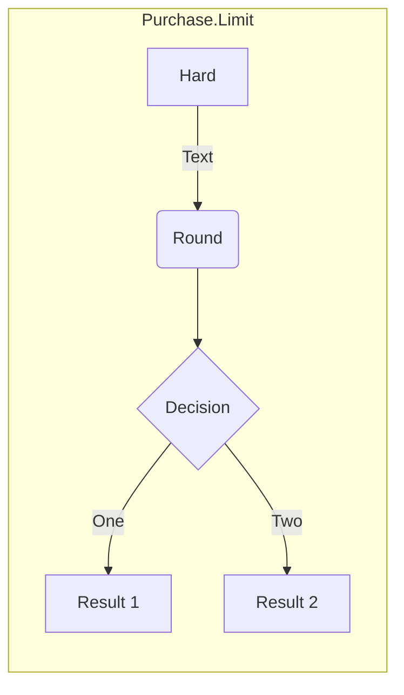
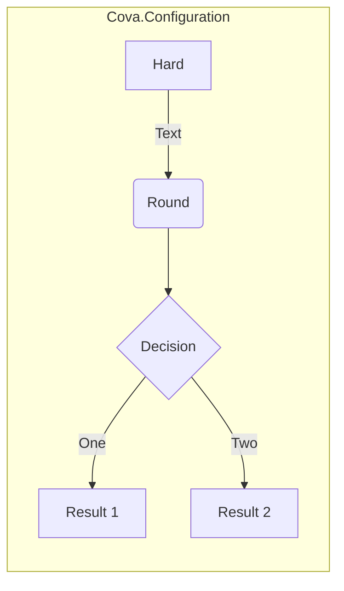
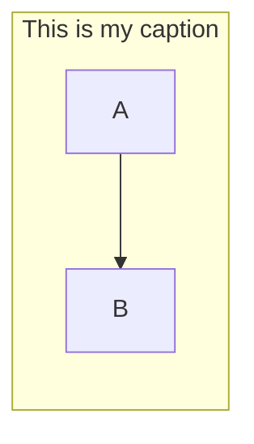
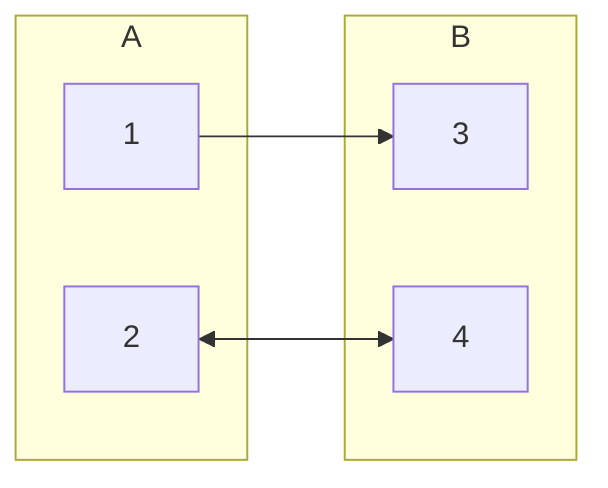
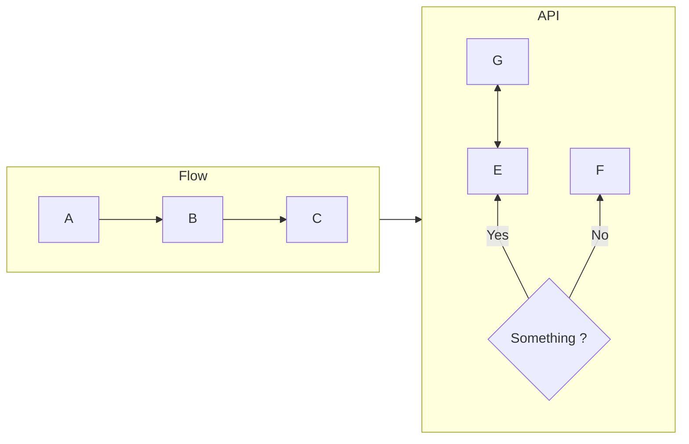
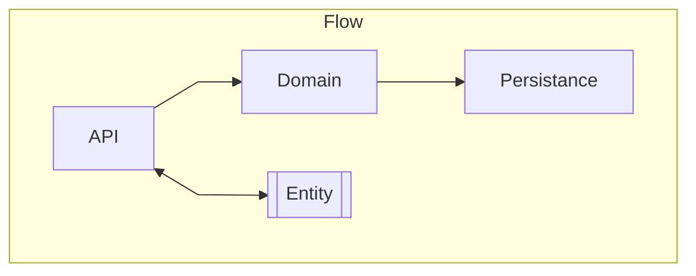

```mermaid
graph LR
    subgraph Purchase.Limit
        A[Hard] -->|Text| B(Round)
        B --> C{Decision}
        C -->|One| D[Result 1]
        C -->|Two| E[Result 2]
    end
```

```mermaid
graph LR
    subgraph Cova.Configuration
        A[Hard] -->|Text| B(Round)
        B --> C{Decision}
        C -->|One| D[Result 1]
        C -->|Two| E[Result 2]
    end
```

```mermaid
graph LR
  subgraph This is my caption
    A --> B
  end
```

```mermaid
flowchart LR
    subgraph A
        1
        2
    end
    subgraph B
        3
        4
    end
    1 --> 3
    2 <--> 4
```

```mermaid
%%{ init : { "flowchart" : { "curve" : "linear" }}}%%
flowchart LR
    subgraph Flow
        direction LR
        A --> B
        B --> C
    end
    subgraph API
        direction BT
        D{Something ?} -- Yes --> E
        D -- No --> F
        E <--> G
    end
    Flow --> API
```

```mermaid
%%{ init : { "flowchart" : { "curve" : "linear" }}}%%
flowchart LR
    subgraph Flow
        direction LR
        API --> Domain
        API <--> C[[Entity]]
        Domain --> Persistance
        
    end

```